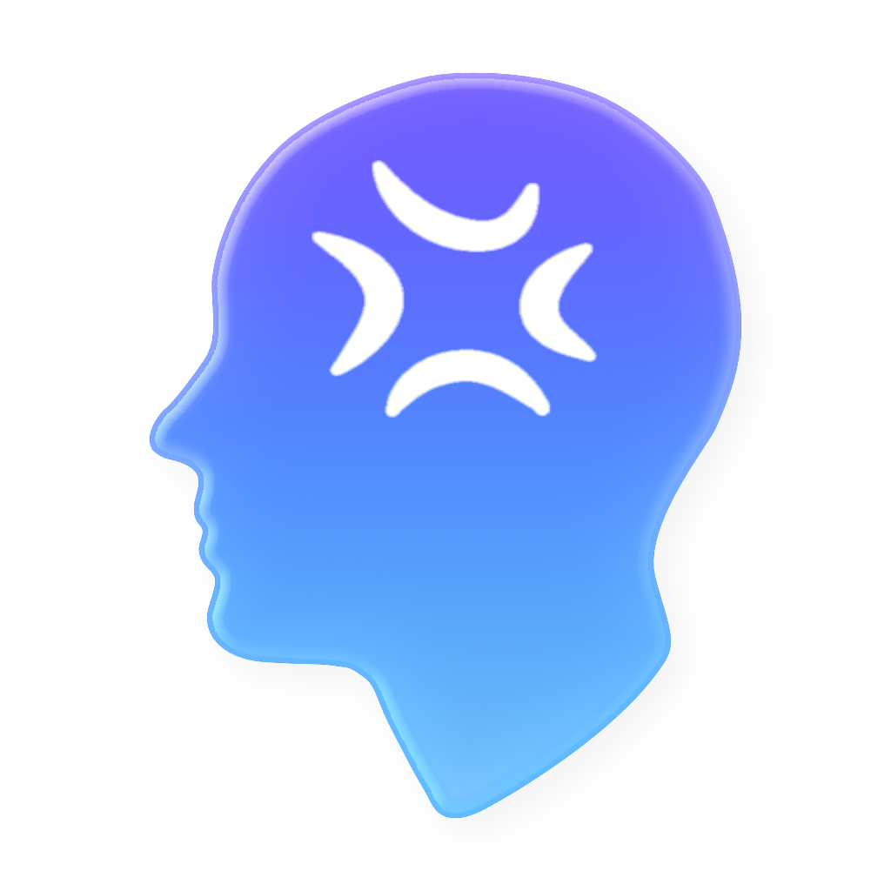

# Mygra

A personal iOS app for tracking migraines and surfacing actionable insights through pattern analysis.

## Overview

Mygra helps migraine sufferers understand their triggers by combining HealthKit data (sleep, hydration, caffeine, energy), local weather conditions via WeatherKit, and on-device Apple Intelligence to provide personalized guidance. Built with SwiftUI and SwiftData, it features seamless iCloud sync, Live Activities, and cross-device support with Apple Watch.

## Features

### Migraine Tracking
- Record migraines with severity levels and detailed notes
- Automatic capture of weather conditions at migraine onset
- Automatic capture of health data snapshot (sleep, hydration, caffeine, energy)
- Live Activities showing ongoing migraine duration on lock screen

### Insights Dashboard
- **Weather Card**: Real-time conditions with pressure, humidity, and storm detection
- **Today Card**: Current health metrics with quick-add for water, caffeine, food, and sleep
- **Quick Bits**: Pattern highlights (e.g., hydration trends, sleep correlations)
- Adaptive layout: side-by-side on iPad/landscape, stacked on phones

### Migraine Assistant (Apple Intelligence)
- Full-screen counselor-style chat with personalized advice
- Context-aware guidance based on your migraine history and patterns
- Requires compatible device with Apple Intelligence (iOS 26+)

### Health Integration
- Read sleep, hydration, caffeine, and energy data from HealthKit
- Quick-add entries that write directly to HealthKit
- Unit conversion support (metric/imperial)

### Platform Integration
- **iCloud Sync**: Seamless multi-device synchronization via CloudKit
- **HealthKit**: Comprehensive health data read/write
- **WeatherKit**: Weather conditions with high-risk alerts
- **Widgets**: Home screen widget showing days since last migraine
- **Apple Watch**: Companion app with real-time phone sync

## Requirements

- iOS 17.0+
- Xcode 16.0+
- Apple Developer account (for CloudKit, HealthKit, and WeatherKit capabilities)

## Setup

1. Clone the repository
2. Open `Mygra.xcodeproj` in Xcode
3. Configure signing with your Apple Developer account
4. Update bundle identifiers and App Group/iCloud container identifiers
5. Build and run

### Required Capabilities

Enable these in your Xcode project:
- iCloud (CloudKit with private database)
- HealthKit
- App Groups (`group.com.molargiksoftware.Mygra`)
- WeatherKit
- Background Modes (location, remote notifications, fetch)

## Architecture

### App Lifecycle

The app progresses through stages managed by `ContentView`:

```
.splash → .onboarding → .main
```

### Manager Pattern

Business logic lives in `@Observable` manager classes:

| Manager | Responsibility |
|---------|---------------|
| `MigraineManager` | CRUD operations, Live Activities, widget updates |
| `HealthManager` | HealthKit authorization and data streaming |
| `WeatherManager` | WeatherKit with throttled updates (10-min interval) |
| `InsightManager` | Pattern aggregation and correlation analysis |
| `IntelligenceManager` | Apple Intelligence chat (iOS 26+) |
| `LocationManager` | CoreLocation wrapper for weather positioning |
| `NotificationManager` | High-risk weather alerts |
| `ComplicationSync` | WatchConnectivity for real-time watch updates |

### Data Layer

- **SwiftData** with iCloud CloudKit sync
- **App Groups** for widget and watch data sharing
- **AppStorage** for user preferences

### Key Patterns

- **Dependency Injection**: Managers injected via SwiftUI `@Environment`
- **Async/Await**: Modern Swift concurrency throughout
- **AsyncStream**: Continuous updates for health and location data

## Project Structure

```
Mygra/
├── MygraApp.swift              # App entry point
├── ContentView.swift           # App stage state machine
├── Managers/                   # Business logic
├── Models/                     # SwiftData models
├── Views/
│   ├── Splash/                 # Launch screen
│   ├── Onboarding/             # Permission flow
│   ├── Main/
│   │   ├── Insights/           # Dashboard with cards
│   │   ├── Migraines/          # List, entry, detail views
│   │   ├── Assistant/          # Apple Intelligence chat
│   │   └── Settings/           # Preferences, PDF export
├── Enumerations/               # Shared enums
├── Errors/                     # LocalizedError types
└── Extensions/                 # Swift extensions

MygraWidgets/                   # Home screen widgets
Mygra Wrist Watch App/          # watchOS companion
```

## Privacy

Mygra is designed with privacy in mind:
- All data stored in your private iCloud container
- On-device Apple Intelligence processing
- Location used only for weather context
- No analytics or tracking
- No health data leaves your devices

## License

This project is licensed under the MIT License - see the [LICENSE](LICENSE) file for details.

## Author

Molargik Software LLC
