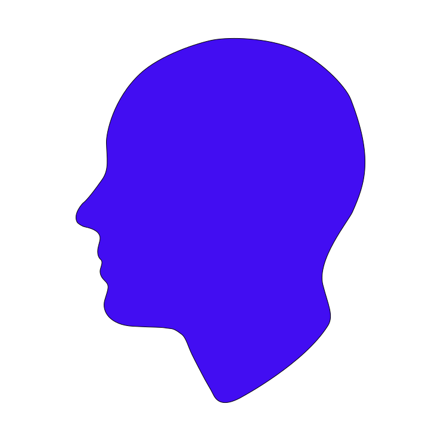

<p align="center">
  
</p>

# Mygra

Your intelligent migraine journal for iPhone and Apple Watch. Mygra logs migraines with intensity over time, attaches the Health and weather context around each attack, and turns the history into rule-based and Apple Intelligence insights — all synced privately through iCloud.

## Features

- **Migraine journal** — start an ongoing migraine (with a Live Activity and Dynamic Island timer) or log a completed one; pin, filter, and search your history.
- **Intensity tracking** — record pain and stress as an attack evolves and see the curve on each migraine's detail screen.
- **Health & weather context** — hydration, sleep, caffeine, energy, steps, heart rate, glucose, SpO₂, and cycle phase from Apple Health; temperature, pressure, humidity, and conditions from WeatherKit, attached at log time.
- **Quick Bits** — deterministic insights across trends, triggers, foods, intake, sleep, weather, cycle phase, intensity patterns, and tags.
- **Migraine Assistant** — on-device Apple Intelligence explanations and an analyst chat over your own entries (iOS 26+). No data leaves the device.
- **Tags, calendar, export** — user-defined tags with drag-to-reorder, a month calendar, and PDF export.
- **Weather risk alerts** — a notification when conditions move into migraine-risk territory.
- **Widgets, Siri & Shortcuts, Spotlight** — days-since widget and complication, "Start / End my migraine" intents, menu-bar commands on iPad and Mac, and semantically searchable migraines.
- **Apple Watch** — see days since your last migraine, start one, or end the ongoing one from your wrist.

## Requirements

- Xcode 27, Swift 6 language mode
- iOS 18 / watchOS 10 (Apple Intelligence features on iOS 26+)
- A real device for HealthKit writes, WeatherKit, and Apple Intelligence
- iCloud container `iCloud.com.molargiksoftware.Mygra`, App Group `group.com.molargiksoftware.Mygra`

## Building

Open `Mygra.xcworkspace` — it resolves the local package in `Packages/Mygra`. There are no external dependencies.

```sh
xcodebuild -workspace Mygra.xcworkspace -scheme Mygra \
  -destination 'platform=iOS Simulator,name=iPhone 17 Pro' build
```

## Project Structure

```
Mygra/
├── Mygra/                      # Thin app target: @main, App Intents, Spotlight, BGTask, menu commands
├── MygraWidgets/               # Days-since widget + ongoing-migraine Live Activity
├── Mygra Wrist Watch App/      # Watch companion (WatchConnectivity over Core wire types)
├── Mygra Wrist Widgets/        # Watch complication
├── Packages/Mygra/             # The real app (SPM umbrella package)
│   ├── Sources/                #   Core · Data · Services · DesignSystem · FeatureShared ·
│   │                           #   FeatureDashboard/Calendar/Migraines/Assistant/Settings/Onboarding · Composition
│   └── Tests/                  #   Host-run suite (swift test, no simulator)
└── Scripts/                    # Localization pinning tooling
```

Dependencies point inward: features depend on the design system and core; data implements core's protocols; core depends on nothing but Foundation and SwiftData. See `CLAUDE.md` for the module-by-module tour.

## Testing

```sh
cd Packages/Mygra && swift test
```

Domain rules, repositories, system-framework orchestration (over fakes), the shared feature models, and composition policy are all covered on the host. The hosted `MygraTests` target covers app-target glue only.

## Privacy

- All migraine data stays in your private iCloud container
- Health data is read and written only with your permission, directly via HealthKit
- Insights and the assistant run entirely on-device
- No analytics or tracking

## License

This project is licensed under the MIT License - see the [LICENSE](LICENSE) file for details.

## Author

Molargik Software LLC
